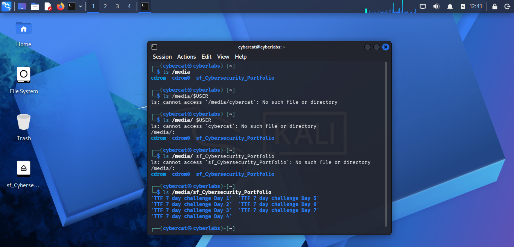
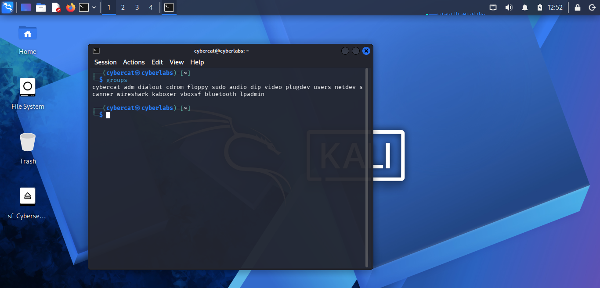
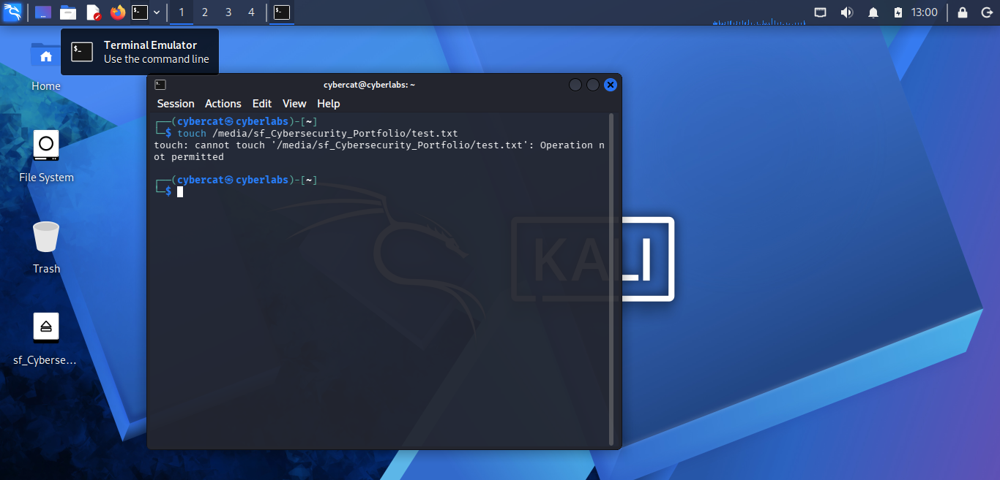
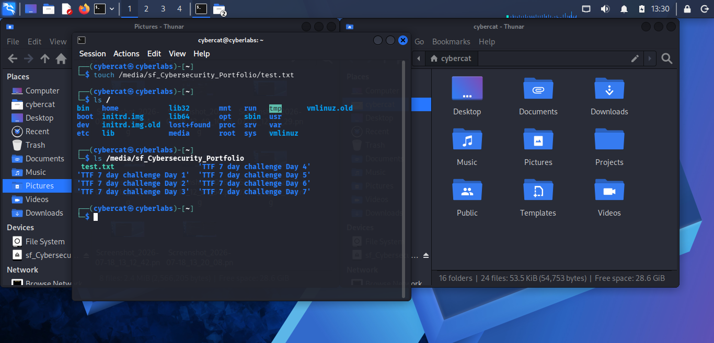

## 📁 Virtualbox Shared Folder Configuration & Troubleshooting

## Objective

Configure a shared folder between Windows 11 and Kali Linux using Oracle VirtualBox.

## Environment

-  Windows 11
-  Kali Linux
-  Oracle VirtualBox

## Initial Configuration

I created the initial **Cybersecurity_Portfolio** folder on the Windows host and began configuring it as a VirtualBox shared folder in Oracle VirtualBox. I enabled the shared folder so it could be accessed from my Kali Linux virtual machine.
This was my first attempt.

## Problem
After configuring the shared folder, I attempted to transfer screenshots from Kali Linux to the VirtualBox shared folder. Instead of transferring the files successfully, I received the following error:

**Operation not permitted**

## Troubleshooting

- Verified VirtualBox shared folder mount

-  I verified that the VirtualBox shared folder was mounted and accessible by checking the /media directory and locating the sf_Cybersecurity_Portfolio shared folder. This confirmed that the shared folder was present and could view it's contents.

-  The user groups were checked here to determine whether my Linux user had the permissions required to access a VirtualBox shared folder. Specifically I was looking for the vboxsf group, to ensure permissions.

- I tested write access to the VirtualBox shared folder by attempting to create a file. The operation failed with an **Operation not permitted** erorr, indicating that write access was restricted.

- 

  - Here I checked for multiple causes in this screen shot

    1. I verified the shared folder was mounted with the command: mount | grep vboxsf

       - I confirmed the shared folder was mounted at: /media/sf_Cybersecurity_Portfolio and this ruled out the possibility that the shared folder wasn't mounted.

    2. I checked the folder permissions

       - I verified permissions and ownerships with the command and it helped determine whether Linux file permissions were preventing access: ls -ld /media/sf_Cybersecurity_Portfolio
       - I also opened the Properties --> Permissions window which showed:
                  - Owner: Root
                  - Group: vboxsf
                  - Owner access: R & W
                  - Group access: R & W

   3. I attempted to verify the VirtualBox Shared Folder module version
                  - I verified with this command: modinfo vboxsf | grep version

  4. I verified the runningLinux kernel
                  - The command used here: uname -r
                  - This confirmed which kernel version Kali Linus was using.

  5. Lastly, i verified the VirtualBox kernel modules were loaded
                  - The command used here: lsmod  | grep vbox
                  - This confirmed that: vboxsf and vboxguest were loaded into the kernel

## Solutions

**Verify successful write access**
-  Tested write permissions by running the command: touch /media/sf_Cybersecurity_Portfolio/test.txt
-  There wasn't any error message printed.
-  I then listed the contents of the shared folder running this command: ls /media/sf_Cybersecurity_Portfolio
-  The output printed: test.txt along with other files and this confirmed that I could now successfully transfer files.

-  Reconfigured the shared folder

  ## Skills Demonstrated

-  Linux

-  VirtualBox

-  Troubleshooting

-  File Permissions

-  Windows/Linux Inegration

- ## Outcome
- Successfully configured a working shared folder between Windows and Kali Linux.

