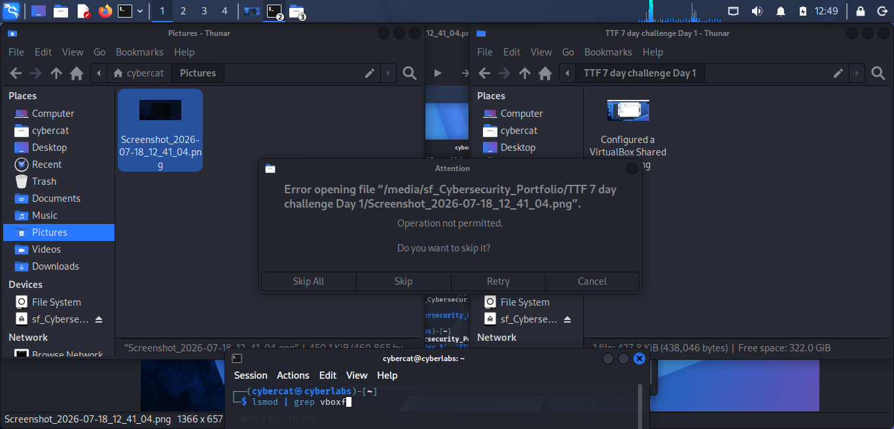

## 📁 Virtualbox Shared Folder Configuration & Troubleshooting

## Objective

Configure a shared folder between Windows 11 and Kali Linux using Oracle VirtualBox.

## Environment

-  Windows 11
-  Kali Linux
-  Oracle VirtualBox

## Initial Configuration

I created the initial **Cybersecurity_Portfolio** folder on the Windows host and began configuring it as a VirtualBox shared folder in Oracle VirtualBox. I enabled the shared folder so it could be accessed from my Kali Linux virtual machine.
This was my first attempt.

## Problem
After configuring the shared folder, I attempted to transfer screenshots from Kali Linux to the VirtualBox shared folder. Instead of transferring the files successfully, I received the following error:

**Operation not permitted**

## Troubleshooting

- Verified VirtualBox Guest Additions

-  Checked the shared folder mount

-  Confirmed my user belonged to the 'vboxsf' group

-  Tested write permissions

-  Reconfigured the shared folder

  ## Skills Demonstrated

-  Linux

-  VirtualBox

-  Troubleshooting

-  File Permissions

-  Windows/Linux Inegration

- ## Outcome
- Successfully configured a working shared folder between Windows and Kali Linux.

