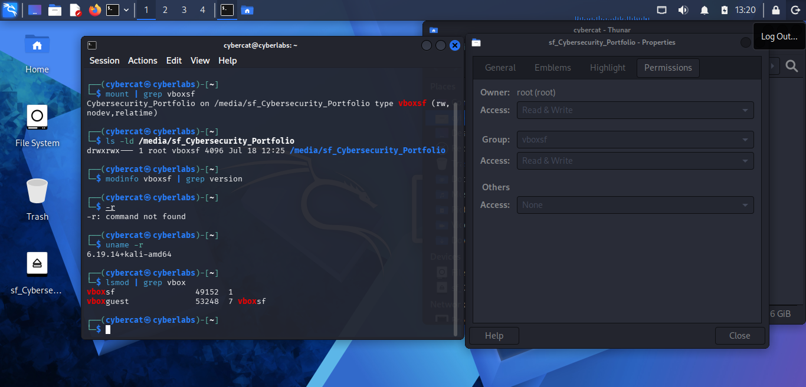
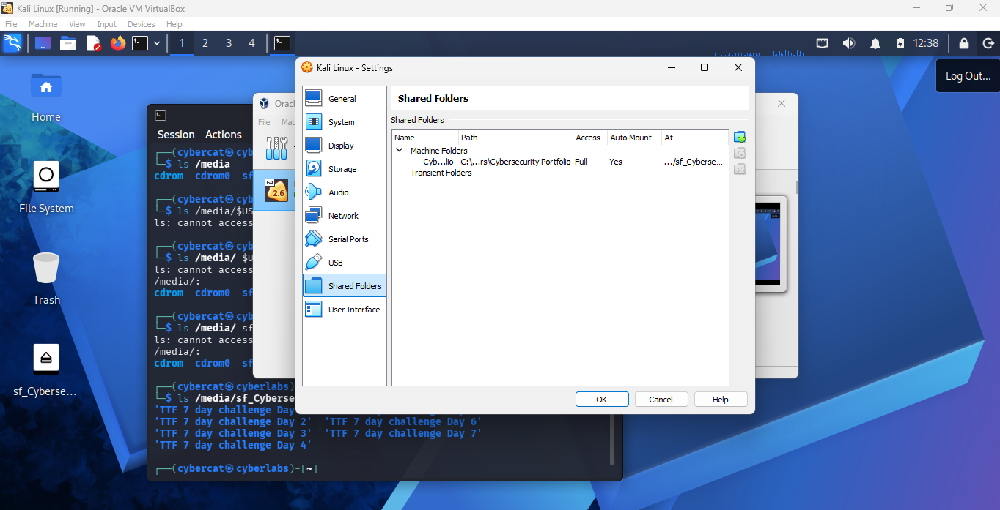
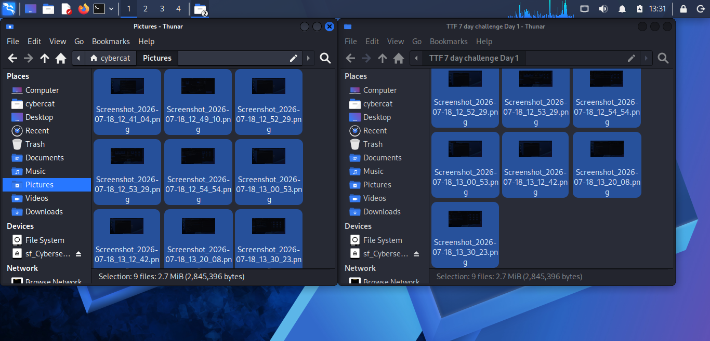

## 📁 Virtualbox Shared Folder Configuration & Troubleshooting

## Objective

Configure a shared folder between Windows 11 and Kali Linux using Oracle VirtualBox.

## Environment

-  Windows 11
-  Kali Linux
-  Oracle VirtualBox

## Initial Configuration

I created the initial **Cybersecurity_Portfolio** folder on the Windows host and began configuring it as a VirtualBox shared folder in Oracle VirtualBox. I enabled the shared folder so it could be accessed from my Kali Linux virtual machine.
This was my first attempt.

## Problem
After configuring the shared folder, I attempted to transfer screenshots from Kali Linux to the VirtualBox shared folder. Instead of transferring the files successfully, I received the following error:

**Operation not permitted**

## Troubleshooting

### Verify Shared Folder Mount

-  I verified that the VirtualBox shared folder was mounted and accessible by checking the /media directory and locating the sf_Cybersecurity_Portfolio shared folder. This confirmed that the shared folder was present and I was able to view its contents.

### Verify User Group Membership

-  I checked my Linux user groups to determine whether my Linux user had the permissions required to access the VirtualBox shared folder. Specifically I verified membership in the 'vboxsf' group.

### Test Write Access

- I attempting to create a file. The operation failed with an "Operation not permitted" error, indicating that write access was restricted.

- 

### Verify Folder Permissions
  
  -  I checked multiple causes of this issue.

    1. Verified the shared folder was mount 
    Used the command: 'mount | grep vboxsf'

       - I confirmed the shared folder was mounted at: '/media/sf_Cybersecurity_Portfolio' and this ruled out the possibility that the shared folder wasn't mounted.

    2. Checked folder permissions
    Used the command: ls -ld /media/sf_Cybersecurity_Portfolio'

       - I verified permissions and ownership with the command and it helped determine whether Linux file permissions were preventing access
       
       - I also opened the Properties --> Permissions window which showed:
                  - Owner: Root
                  - Group: vboxsf
                  - Owner access: Read & Write
                  - Group access: Read & Write
  
    3. Verified the VirtualBox module
      Used the command:  modinfo vboxsf | grep version

    4. I verified the runningLinux kernel
                  - The command used here: uname -r
                  - This confirmed the active Kali Linus kernel version. 
    
    5. Verify VirtualBox kernel Modules
        Used the command: lsmod | grep vbox
   
    - This confirmed that: vboxsf and vboxguest were loaded into the kernel

## Solution

- **Root Cause** The VirtualBox shared folder was initially configured to an incorrect Windows host directory. Reconfiguring the shared folder to my Windows user profile '(C:\Users\Catri\Documents\Cybersecurity_Portfolio\TTF 7 day challenge Day 1)' restored write access and resolved the file transfer issue.

**Verified successful write access**
-  Tested write permissions by running the command: 'touch /media/sf_Cybersecurity_Portfolio/test.txt'
-  No erorr message was returned.
-  I then listed the contents of the shared folder running this command: 'ls /media/sf_Cybersecurity_Portfolio'
-  The command output displayed: test.txt along with other files and this confirmed that I could now successfully transfer files.

### Verified successful file transfer
  
  

- After updating the shared folder configuration, I successfully transferred files between the Windows host and the Kali Linux virtual machine. The files were visible for both operating systems.
  
 
  
  
  ## Skills Demonstrated

-  Linux Command Line

-  Oracle VirtualBox

-  Linux File Permissions

-  Systematic Troubleshooting

-  Windows & Linux File Sharing

- Virtual Machine Adminstration

- ## Outcome
- Successfully configured a VirtualBox shared folder between Windows 11 and Kali Linux, restoring write access and enabling reliable file transfers between the host and virtual machine.

